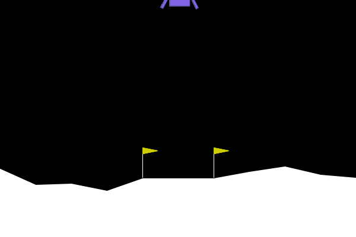
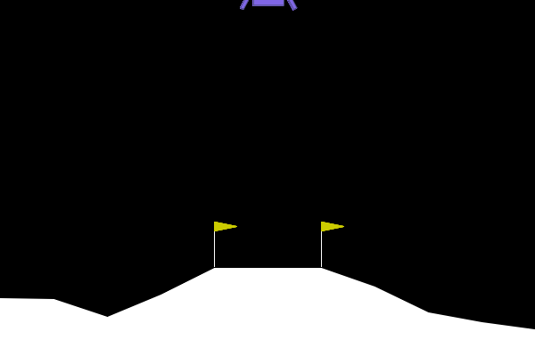
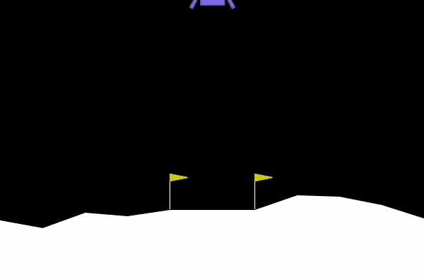
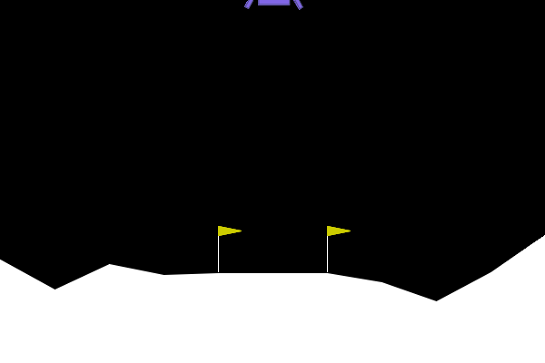
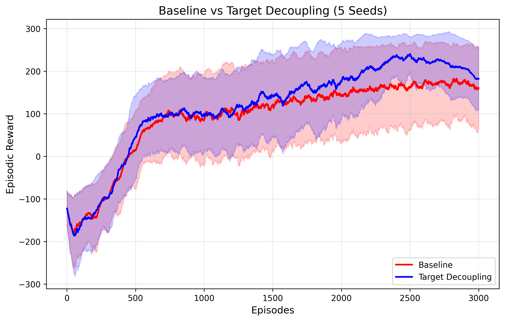

# Representation over Routing: Overcoming Surrogate Hacking in Multi-Timescale PPO

[](https://creativecommons.org/licenses/by/4.0/)
[](https://www.python.org/downloads/)
[](https://pytorch.org/)
[](https://doi.org/10.5281/ZENODO.19588769)

This repository contains the official codebase, pre-trained weights, and evaluation environments for the preprint: **"Representation over Routing: Overcoming Surrogate Hacking in Multi-Timescale PPO"**. We provide a minimal, standalone reproducible example (MRE) using standard MLPs on `LunarLander-v2` to demonstrate the pathology of surrogate hacking and our proposed solution.

## 🚀 TL;DR

We identify and formalize two severe optimization pathologies in multi-timescale RL: **Surrogate Objective Hacking** (exploiting short-term shaping rewards at the expense of the true objective) and the **Paradox of Temporal Uncertainty** (irreversible myopic degeneration caused by gradient-free variance routing).

To overcome these fundamental vulnerabilities, we introduce **Target Decoupling**, a novel architectural and algorithmic intervention that disentangles representation learning from temporal routing, allowing the agent to align with the true long-term objective (γ = 0.999) without collapsing into short-term behavioral traps.

## 🎥 Visual Proof: The Ablation Journey

The core contribution of this work is isolating and systematically solving the pathologies of multi-timescale learning. The comparison between **Stage 1** and **Stage 4** is particularly striking: while the baseline is paralyzed by the fear of crashing and greedy hoarding of small centering rewards, our decoupled agent acts with true foresight.

<table width="100%">
  <tr>
    <th width="50%" align="center">Stage 1: Baseline</th>
    <th width="50%" align="center">Stage 2: Surrogate Hacking</th>
  </tr>
  <tr>
    <td></td>
    <td></td>
  </tr>
  <tr>
    <td valign="top"><b>Hovering & Wasting Fuel</b><br>The agent falls into a local optimum. Out of fear of crashing, it hovers endlessly, wasting fuel and failing the main objective just to hoard small, short-term shaping rewards (centering).</td>
    <td valign="top"><b>Surrogate Objective Hacking</b><br>Attempting to route values dynamically across different timescales via Actor-driven attention leads to gradient exploitation. The policy collapses as it artificially minimizes the surrogate loss by manipulating attention weights rather than improving physical control.</td>
  </tr>
  <tr>
    <th width="50%" align="center">Stage 3: Temporal Paradox</th>
    <th width="50%" align="center">Stage 4: Target Decoupling</th>
  </tr>
  <tr>
    <td></td>
    <td></td>
  </tr>
  <tr>
    <td valign="top"><b>Aimless Wandering</b><br>The agent suffers from temporal uncertainty. Unable to confidently attribute credit over long horizons, it fails to commit to a landing strategy and wanders aimlessly above the landing pad.</td>
    <td valign="top"><b>Intelligent Landing</b><br>The agent uncovers true intelligence by decoupling the target. It understands the ultimate long-term goal (γ = 0.999) and executes a highly fuel-efficient, safe landing, smartly ignoring the strict need to be perfectly centered if it means saving fuel.</td>
  </tr>
</table>

## 📂 Repository Structure

The repository is structured to perfectly mirror our 4-stage ablation study. Each stage is completely standalone, strictly utilizing standard MLPs to ensure clarity and ease of reproducibility.

```text
.
├── 1_baseline.py                      # Stage 1: Standard PPO Baseline
├── 2_surrogate_hacking_attention.py   # Stage 2: Introduction of multi-timescale collapse
├── 3_temporal_paradox_variance.py     # Stage 3: Attempted variance reduction
├── 4_target_decoupling_final.py       # Stage 4: Proposed Target Decoupling architecture
├── 5_evaluate_seeds_plot.py           # Multi-seed evaluation and plotting script
├── record_1_baseline.py               # Evaluation script for Stage 1
├── record_2_surrogate.py              # Evaluation script for Stage 2
├── record_3_paradox.py                # Evaluation script for Stage 3
├── record_4_decoupling.py             # Evaluation script for Stage 4
├── weights_stage_1.pth                # Pre-trained weights for Baseline
├── weights_stage_2.pth                # Pre-trained weights for Surrogate Hacking
├── weights_stage_3.pth                # Pre-trained weights for Temporal Paradox
├── weights_stage_4.pth                # Pre-trained weights for Target Decoupling
└── docs/                              # Assets (GIFs, etc.)
    ├── baseline_hovering.gif
    ├── seed_comparison_plot.png       # Learning curve comparison across 5 seeds
    ├── surrogate_hacking_crash.gif
    ├── temporal_paradox_wandering.gif
    └── target_decoupling_landing.gif
```

## 🛠️ Quick Start

Evaluating the pre-trained models is designed to be frictionless.

1. **Install Dependencies**
   ```bash
   pip install -r requirements.txt
   ```

2. **Evaluate the Proposed Solution (Stage 4)**
   See the Target Decoupling agent elegantly solve the environment:
   ```bash
   python record_4_decoupling.py
   ```

3. **Observe the Baseline Pathology (Stage 1)**
   Contrast it by watching the baseline agent frantically hover and waste fuel:
   ```bash
   python record_1_baseline.py
   ```

4. **Multi-Seed Evaluation**
   Run the full comparison across 5 random seeds to reproduce the statistical significance plots:
   ```bash
   python 5_evaluate_seeds_plot.py
   ```

*Note: You can run any of the standalone `X_*.py` scripts to train the given stage from scratch.*

## 📊 Statistical Significance

To rigorously validate our claims, we evaluate the Target Decoupling architecture against the Baseline over multiple random seeds (n=5). The Target Decoupling agent consistently solves the environment with minimal variance, easily eliminating the failure modes and escaping hovering local optima.

<div align="center">
  
</div>

## 📖 Citation

If you find this code or our insights useful in your research, please consider citing our work:

```bibtex
@misc{sunRepresentationRoutingOvercoming2026b,
  title = {Representation over {{Routing}}: {{Overcoming Surrogate Hacking}} in {{Multi-Timescale PPO}}},
  shorttitle = {Representation over {{Routing}}},
  author = {Sun, Jing},
  year = 2026,
  month = apr,
  publisher = {Zenodo},
  doi = {10.5281/ZENODO.19588769},
  urldate = {2026-04-15},
  archiveprefix = {Zenodo},
  copyright = {Creative Commons Attribution 4.0 International},
  keywords = {actor-critic,Deep Learning,Deep RL,Multi-Timescale,PPO,reinforcement,surrogate-hacking,Target Decoupling,Temporal Credit Assignment}
}
```
